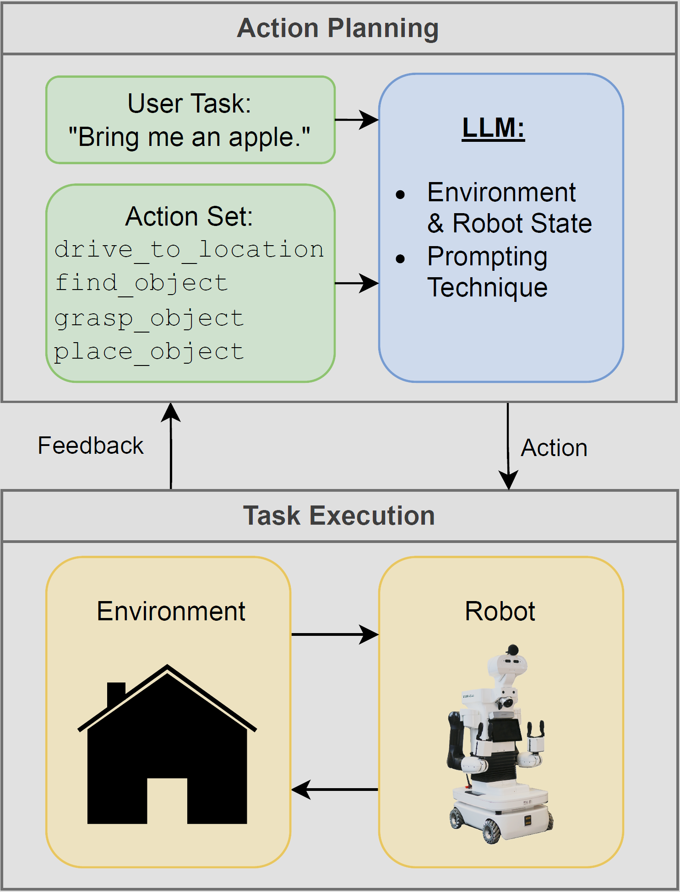

# Comparison of Prompt Engineering Techniques for Task Planning and Execution in Service Robotics


<p float="middle">
  
</p>

Official implementation of:  **A Comparison of Prompt Engineering Techniques for Task Planning and Execution in Service Robotics** by Jonas Bode, Bastian Pätzold, Raphael Memmesheimer and Sven Behnke, published at Humanoids 2024. 

## Installation

This simulation works using Python. Needed packages are [NumPy](https://numpy.org/) as well as the API packages for [OpenAI](https://github.com/openai/openai-python) and [Mistral](https://github.com/mistralai/client-python). These can also be installed using pip.


```
pip install -r .\requirements.txt
```


## Usage

How to configure and run an experiment is showcased in `example.py`. During execution transcripts of the conversation with the LLM will be saved. Each trancript is named `<seed number>.txt`. In addition a summarizing file called `meta.txt` will be created in the directory which contains metrics of all samples generated in this experiment. 

## Data from the Paper

If you wish to get access to the transcripts generated for our paper please contact Jonas Bode per email [s6jobode@uni-bonn.de](mailto:s6jobode@uni-bonn.de).

## Contact and Citation

This repository is maintained by [Jonas Bode](mailto:s6jobode@uni-bonn.de).

Please consider citing our paper if you find our work or our repository helpful. Bibtex will follow here upon publication.

